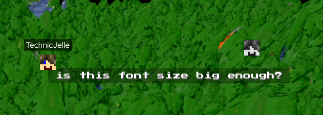
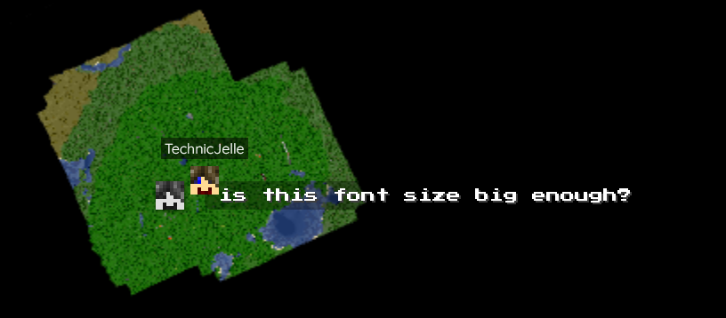

# BlueMap Chat Markers

This Paper plugin adds chat markers to [BlueMap](https://github.com/BlueMap-Minecraft/Bluemap)

Compatible with Paper 1.13+, just like BlueMap itself.

You can customise the style of the markers with the [`textStyle.css`](src/main/resources/textStyle.css) file in the config directory.\
To reload it, just reload BlueMap itself with `/bluemap reload`.

If you're using VentureChat, you may want to use out a fork of this plugin instead: [Mark-225/BlueMapVentureChatMarkers](https://github.com/Mark-225/BlueMapVentureChatMarkers)\
(I am not responsible for it, though)

## [Click here to download!](../../releases/latest)

## [TODO list](../../projects/1?fullscreen=true)

## Support
To get support with this plugin, join the [BlueMap Discord server](https://bluecolo.red/map-discord) and ask your questions in [#3rd-party-support](https://discord.com/channels/665868367416131594/863844716047106068). You're welcome to ping me, @TechnicJelle.

\

